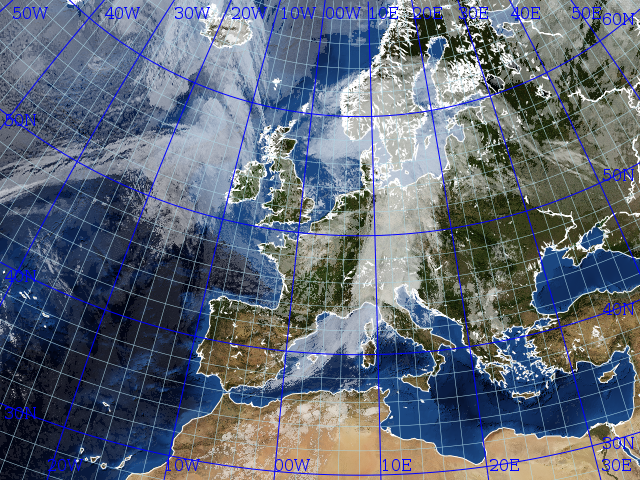

Adding graticule to images
--------------------------

Pycoast can be used to add graticule to images. For PIL_:

    >>> from PIL import Image, ImageFont
    >>> from pycoast import ContourWriterAGG
    >>> proj4_string = '+proj=stere +lon_0=8.00 +lat_0=50.00 +lat_ts=50.00 +ellps=WGS84'
    >>> area_extent = (-3363403.31,-2291879.85,2630596.69,2203620.1)
    >>> area_def = (proj4_string, area_extent)
    >>> cw = ContourWriterAGG('/home/esn/data/gshhs')
    >>> font = ImageFont.truetype("/usr/share/fonts/truetype/ttf-dejavu/DejaVuSerif.ttf",16)
    >>> img = Image.open('BMNG_clouds_201109181715_areaT2.png')
    >>> cw.add_coastlines(img, area_def, resolution='l', level=4)
    >>> cw.add_grid(img, area_def, (10.0,10.0),(2.0,2.0), font,fill='blue',
    ...             outline='blue', minor_outline='blue')
    >>> img.show()

.. image:: images/euro_grid.png

The font argument is optional for PIL if it is not given a default font will be used.

and for AGG:

    >>> from PIL import Image, ImageFont
    >>> from pycoast import ContourWriterAGG
    >>> import aggdraw
    >>> proj4_string = '+proj=stere +lon_0=8.00 +lat_0=50.00 +lat_ts=50.00 +ellps=WGS84'
    >>> area_extent = (-3363403.31,-2291879.85,2630596.69,2203620.1)
    >>> area_def = (proj4_string, area_extent)
    >>> cw = ContourWriterAGG('/home/esn/data/gshhs')
    >>> font = aggdraw.Font('black', '/usr/share/fonts/truetype/ttf-dejavu/DejaVuSerif.ttf', 
    ...                     opacity=127, size=16)
    >>> img = Image.open('BMNG_clouds_201109181715_areaT2.png')
    >>> cw.add_coastlines(img, area_def, resolution='l', level=4)
    >>> cw.add_grid(img, area_def, (10.0,10.0),(2.0,2.0),font,
    ...             outline='blue',outline_opacity=175,width=1.0,
    ...             minor_outline='lightblue',minor_outline_opacity=200,minor_width=0.5,
    ...             minor_is_tick=False)
    >>> img.show()

Note the difference in the optional font argument for PIL and AGG. With AGG the
font argument is mandatory unless the keyword argument :attr:`write_text=False`
is used.

From v0.5.0 the graticule is also usable for globe projections:

    >>> from PIL import Image
    >>> from pycoast import ContourWriterAGG
    >>> img = Image.new('RGB', (425, 425))
    >>> proj4_string = '+proj=geos +lon_0=0.0 +a=6378169.00 +b=6356583.80 +h=35785831.0'
    >>> area_extent = (-5570248.4773392612, -5567248.074173444, 5567248.074173444, 5570248.4773392612)
    >>> area_def = (proj4_string, area_extent)
    >>> cw = ContourWriterAGG(gshhs_root_dir)
    >>> cw.add_coastlines(img, area_def, resolution='l')
    >>> cw.add_grid(img, area_def, (10.0,10.0),(2.0,2.0), fill='blue', 
    ... outline='blue', minor_outline='blue', write_text=False)
    >>> img.show()

.. image:: images/grid_geos_agg.png

The lon and lat labeling is shown where the lines intersect the image border.
By default the lon intersections with top and bottom and the lat intersections with left and right border are displayed .
The placement behaviour can be controlled with the :attr:`lon_placement` and :attr:`lat_placement` keyword variables.
The placement specifier is a string containing the desired placement where 't' is top, 'b' bottom, 'l' left and 'r' right.
E.g. :attr:`lon_placement='tl'` will make the lon labels display at the top and left border.

    >>> from PIL import Image
    >>> from pycoast import ContourWriterAGG
    >>> import aggdraw
    >>> img = Image.new('RGB', (425, 425))
    >>> proj4_string = '+proj=laea +lat_0=90 +lon_0=0 +a=6371228.0 +units=m'
    >>> area_extent = (-5326849.0625, -5326849.0625, 5326849.0625, 5326849.0625)
    >>> area_def = (proj4_string, area_extent)
    >>> cw = ContourWriterAGG('/home/esn/data/gshhs')
    >>> cw.add_coastlines(img, area_def, resolution='c', level=4)
    >>> font = aggdraw.Font('blue', '/usr/share/fonts/truetype/ttf-dejavu/DejaVuSerif.ttf', size=10)
    >>> cw.add_grid(img, area_def, (10.0,10.0),(2.0,2.0), font=font, fill='blue',
    ...             outline='blue', minor_outline='blue',
    ...             lon_placement='tblr', lat_placement='')
    >>> img.show()  

.. image:: images/nh_grid_coarse_agg.png

Tip: If the adding graticule with AGG fails with something like:

.. code-block:: bash

    Traceback (most recent call last):
        File "grid_demo_AGG.py", line 13, in <module>
            font=aggdraw.Font("blue", "/usr/share/fonts/truetype/ttf-dejavu/DejaVuSerif.ttf", size=16)
    IOError: cannot load font (no text renderer)

make sure the FREETYPE_ROOT in setup.py of aggdraw points to the correct location e.g. set *FREETYPE_ROOT = "/usr"*

.. _PIL: http://www.pythonware.com/products/pil/

