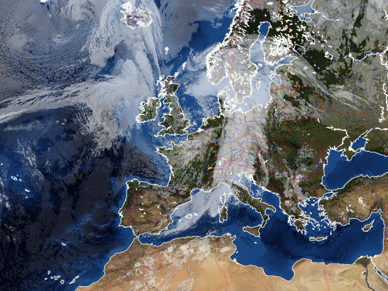

.. pycoast documentation master file, created by
   sphinx-quickstart on Thu Sep 22 15:38:22 2011.
   You can adapt this file completely to your liking, but it should at least
   contain the root `toctree` directive.

Pycoast
=======

Pycoast is a Python package to add coastlines, borders and rivers to raster
images using data from the GSHHS and WDBII datasets

.. toctree::
   :maxdepth: 2

   installation
   usage
   high_quality_contours
   graticule
   config
   polygons_and_lines
   shapefiles
   test
   PyCoast API <api/pycoast>

