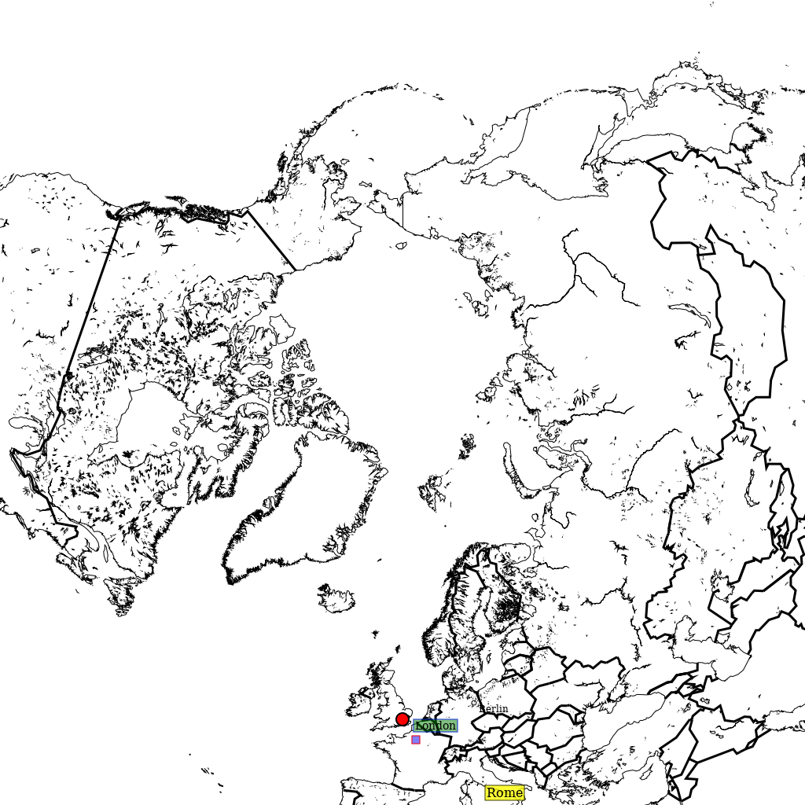

Add custom points with descriptions
-----------------------------------

Pycoast can add a symbol to points of interest on an image. The following examples show how
we might use the :meth:`~pycoast.cw_agg.ContourWriterAGG.add_points` method to annotate the
points on an image.

First of all, we setup a PIL image with an area definition, then we add coastlines and
borders for reference.

    >>> from PIL import Image
    >>> from pycoast import ContourWriterAGG
    >>> img = Image.new('RGB', (1024, 1024), (255, 255, 255))
    >>> proj4_string = '+proj=laea +lat_0=90 +lon_0=0 +a=6371228.0 +units=m'
    >>> area_extent = (-5326849.0625, -5326849.0625, 5326849.0625, 5326849.0625)
    >>> area_def = AreaDefinition('nh', 'nh', 'nh', proj4_string, 1024, 1024, area_extent)
    >>> cw = ContourWriterAGG('/home/esn/data/gshhs')
    >>> cw.add_coastlines(img, area_def, outline='black', resolution='l', level=4)
    >>> cw.add_borders(img, area_def, outline='black', width=3, level=1, resolution='c')

Now we can add a circle, which is the default symbol, with default point size 6 at the
location of Berlin, the name of the location will marked in a text box with black borders
and the default text size is 12.

    >>> points_list = [((13.4050, 52.5200), 'Berlin')]
    >>> cw.add_points(pil_img, area, points_list=points_list, font_file=font_file)

We can also annotate the image with text only by setting the ptsize to 0.
The example below will add 'Rome' at the given location without a symbol.

    >>> points_list = [((12.4964, 41.9028), 'Rome')]
    >>> cw.add_points(pil_img, area, points_list=points_list,
    ...               font_file=font_file, font_size=16,
    ...               symbol='circle', ptsize=0,
    ...               box_outline='black', text_linewidth=1,
    ...               box_fill='yellow', box_opacity=200)

Similarly, assign the description as an empty string will only draw the symbol on the image.
The example below will draw a square symbol at the location of Paris.

    >>> points_list = [((2.3522, 48.8566), '')]
    >>> cw.add_points(pil_img, area, points_list=points_list,
    ...               font_file=font_file,
    ...               symbol='square', ptsize=10,
    ...               outline='red', width=1,
    ...               fill='blue', fill_opacity=128)

Finally, we can fully customize the annotation as the example below, which will add
a circle in black with line width set to 2 and filled in red color with opacity equals 255;
the description will be 'London' in a textbox with blue borders and filled with green color
with opacity set to 128.

    >>> points_list = [((0.1278, 51.5074), 'London')]
    >>> cw.add_points(img, area_def, points_list=points_list,
    ...               font_file=font_file, font_size=14,
    ...               symbol='circle', ptsize=14,
    ...               outline='black', width=2,
    ...               fill='red', fill_opacity=255,
    ...               box_outline='blue', box_linewidth=1.5,
    ...               box_fill='green', box_opacity=128)
    >>> img.show()

Please check out the docstrings of the :meth:`~pycoast.cw_agg.ContourWriterAGG.add_points`
function for the full description of the parameters.

Moreover, we can organize the overlay parameters in a dictionary and use :meth:`~pycoast.cw_agg.ContourWriterAGG.add_overlay_from_dict`
to apply the overlays in one shot.

    >>> points = {'points_list': [((2.3522, 48.8566), 'Paris'), ((0.1278, 51.5074), 'London')],
    ...           'font': font_file,
    ...           'symbol': 'circle', 'ptsize': 16,
    ...           'outline': 'black', 'width': 3,
    ...           'fill': 'red', 'fill_opacity': 128,
    ...           'box_outline': 'blue', 'box_linewidth': 0.5,
    ...           'box_fill': 'yellow', 'box_opacity': 200}

    >>> overlays = {'coasts': {'outline': 'black', 'level': 4, 'resolution': 'l'},
    ...             'borders': {'outline': 'black', 'width': 3, 'level': 1, 'resolution': 'c'},
    ...             'points': points}

    >>> img = cw.add_overlay_from_dict(overlays, area_def)

    >>> img.save('./add_overlays_from_dict.png')

Here we have used the `points` key in the `overlays` dict to pass a list of points.
We could also use the `text` key in the `overlays` dict, which is just an alias,
they both behave the same. This allows for two different lists of points to be plotted
with their own rendering styles. Setting `symbol:None` and `ptsize:0` will render
just text without a symbol, but this is not automatically implied by the use of `text`.

The coordinates of the point are specified in geographic degrees longitude (N), latitude (E)
by default but can be changed to projected image coordinates in pixels (right, down).
Use the `coord_ref` key in your `points` dict and with a value `'lonlat'` or `'image'`.
Negative image coordinates will go left/up from the opposite side of the image.

Thus the dict `overlays = { 'text': { 'symbol':None, 'ptsize':0, 'coord_ref':'image'`
can be used to plot text strings at fixed points on the image regardless of projection.

.. _PIL: http://www.pythonware.com/products/pil/
