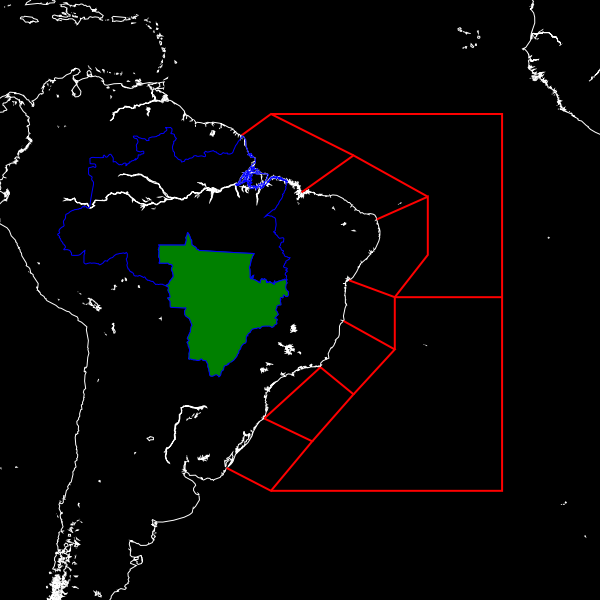

Shapes from ESRI shape files
-------------------------------

Pycoast supports plotting of polygons and polylines from ESRI shapefiles,
currently only in lonlat coordinates format. 
In the following example we use :attr:`add_shapefile_shapes` method to plot all line shapes
found in the file Metareas.shp. We then use the :attr:`add_shapefile_shape` (notice the singular) 
to plot only the 3rd and 4th shape_id within the file BR_Regioes.shp.

    >>> from pycoast import ContourWriterAGG
    >>> img = Image.new('RGB', (600, 600))
    >>> proj4_string = '+proj=merc +lon_0=-60 +lat_ts=-30.0 +a=6371228.0 +units=m'
    >>> area_extent = (-2000000.0, -5000000.0, 5000000.0, 2000000.0)
    >>> area_def = (proj4_string, area_extent)
    >>> cw = ContourWriterAGG(gshhs_root_dir)
    ...
    >>> cw.add_coastlines(img, area_def, resolution='l', level=4)
    >>> cw.add_shapefile_shapes(img, area_def, 
                                'test/test_data/shapes/Metareas.shp',
                                outline='red',width=2)
    >>> cw.add_shapefile_shape(img, area_def, 
                               'test/test_data/shapes/divisao_politica/BR_Regioes.shp',
                               3, outline='blue')
    >>> cw.add_shapefile_shape(img, area_def, 
                               'test/test_data/shapes/divisao_politica/BR_Regioes.shp',
                               4, outline='blue', fill='green')

Reproject unsupported shapefiles
********************************

If your shapefile is not in lonlat coordinates, then you can re-project your shape file using
:attr:`ogr2ogr` (part of GDAL_ tools), e.g.

.. code-block:: bash

    $ ogr2ogr original.shp  lonlat.shp  -t_srs "+proj=latlong"

This should work if you have all the extra meta-files original.* included with your original.shp.
Please refer to the OGR_ documentation for more information.

Complex shape drawing
*********************

To further customize how shapes are drawn the
:meth:`~pycoast.ContourWriterAGG.add_shapes` can be used. This is the low-level
version of the ``add_shapefile_shape`` method described above. This method
takes an iterable of shape objects to draw with optional drawing parameters.
In combination with python generators this can provide a high performance
method for drawing multiple shapes with per-shape customization.
In the below example a custom generator function is defined to open a shapefile
and specify that each polygon should be blue and any other shape should be red.

    >>> import shapefile
    >>> def my_shapes_generator():
    ...     sf = shapefile.Reader(filename)
    ...     for shape in sf.shapes():
    ...         if shape.shapeType == shapefile.POLYGON:
    ...             kwargs = {'fill': (0, 0, 255)}
    ...         else:
    ...             kwargs = {'fill': (255, 0, 0)}
    ...         yield (shape, kwargs)
    ... cw.add_shapes(img, area_def, my_shapes_generator())

.. _OGR: http://www.gdal.org/ogr2ogr.html
.. _GDAL: http://www.gdal.org/
.. _PIL: http://www.pythonware.com/products/pil/

