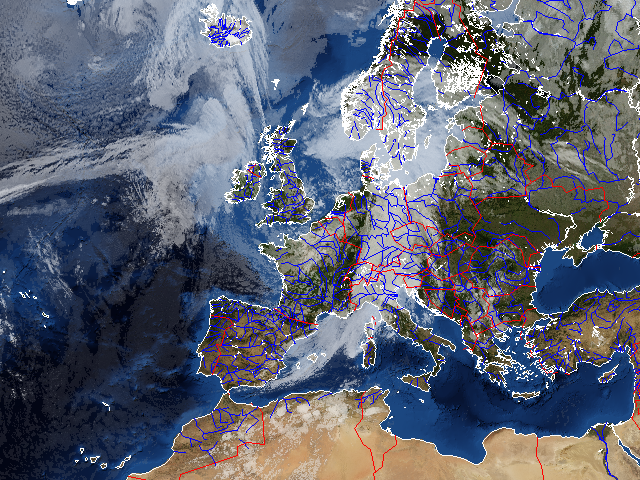

Usage
-----

Pycoast can be used to add coastlines, borders and rivers to a raster image if
the geographic projection of the image and the image extent in projection
coordinates are known

.. image:: images/BMNG_clouds_201109181715_areaT2.png

Pycoast can add contours to either a PIL image object:

    >>> from PIL import Image
    >>> from pycoast import ContourWriterAGG
    >>> img = Image.open('BMNG_clouds_201109181715_areaT2.png')
    >>> proj4_string = '+proj=stere +lon_0=8.00 +lat_0=50.00 +lat_ts=50.00 +ellps=WGS84'
    >>> area_extent = (-3363403.31,-2291879.85,2630596.69,2203620.1)
    >>> area_def = (proj4_string, area_extent)
    >>> cw = ContourWriterAGG('/home/esn/data/gshhs')
    >>> cw.add_coastlines(img, area_def, resolution='l', level=4)
    >>> cw.add_rivers(img, area_def, level=5, outline='blue')
    >>> cw.add_borders(img, area_def, outline=(255, 0, 0))
    >>> img.show()
    
or to an image file:

    >>> from pycoast import ContourWriterAGG
    >>> proj4_string = '+proj=stere +lon_0=8.00 +lat_0=50.00 +lat_ts=50.00 +ellps=WGS84'
    >>> area_extent = (-3363403.31,-2291879.85,2630596.69,2203620.1)
    >>> area_def = (proj4_string, area_extent)
    >>> cw = ContourWriterAGG('/home/esn/data/gshhs')
    >>> cw.add_coastlines_to_file('BMNG_clouds_201109181715_areaT2.png', area_def, resolution='l', level=4)
    >>> cw.add_rivers_to_file('BMNG_clouds_201109181715_areaT2.png', area_def, level=5, outline='blue')
    >>> cw.add_borders_to_file('BMNG_clouds_201109181715_areaT2.png', area_def, outline=(255, 0, 0))
    
Where the :attr:`area_extent` is the extent of the image in projection
coordinates as (x_ll, y_ll, x_ur, x_ur) measured at pixel edges.

The argument to :class:`~pycoast.cw_agg.ContourWriterAGG` must be replaced with your *GSHHS_DATA_ROOT*.

The resulting (not so pretty) image shows the effect of the various
arguments. The :attr:`resolution` keyword argument controls the resolution of
the dataset used. It defaults to 'c' for coarse. Increasing the resolution also
increases the processing time. The :attr:`level` keyword argument controls the
detail level of the dataset used. It defaults to *1* for the lowest detail
level. See method docstrings for information about other possible argument
values.

Example with tuple
******************

Creating an image with coastlines only:

    >>> from PIL import Image
    >>> from pycoast import ContourWriterAGG
    >>> img = Image.new('RGB', (425, 425))
    >>> proj4_string = '+proj=geos +lon_0=0.0 +a=6378169.00 +b=6356583.80 +h=35785831.0'
    >>> area_extent = (-5570248.4773392612, -5567248.074173444, 5567248.074173444, 5570248.4773392612)
    >>> area_def = (proj4_string, area_extent)
    >>> cw = ContourWriterAGG('/home/esn/data/gshhs')
    >>> cw.add_coastlines(img, area_def, resolution='l')
    >>> img.show()

.. image:: images/geos_coast.png

Example with AreaDefinition
***************************

Instead of a tuple for :attr:`area_def` a pyresample
:class:`~pyresample.geometry.AreaDefinition` object can be used. The code
below produces the same image as above.

    >>> from PIL import Image
    >>> from pycoast import ContourWriterAGG
    >>> from pyresample.geometry import AreaDefinition
    >>> img = Image.new('RGB', (425, 425))
    >>> area_def = AreaDefinition('my_area', 'Area Description', 'geos_proj',
    ...     {'proj': 'geos', 'lon_0': 0.0, 'a': 6378169.00, 'b': 6356583.80, 'h': 35785831.0},
    ...     425, 425,
    ...     (-5570248.4773392612, -5567248.074173444, 5567248.074173444, 5570248.4773392612))
    >>> cw = ContourWriterAGG('/home/esn/data/gshhs')
    >>> cw.add_coastlines(img, area_def, resolution='l')
    >>> img.show()

.. _pyshp: http://code.google.com/p/pyshp/
.. _PIL: http://www.pythonware.com/products/pil/
.. _aggdraw: http://effbot.org/zone/aggdraw-index.htm
