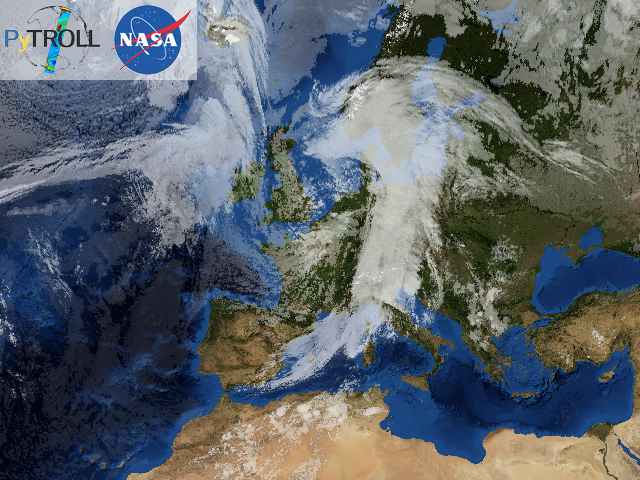
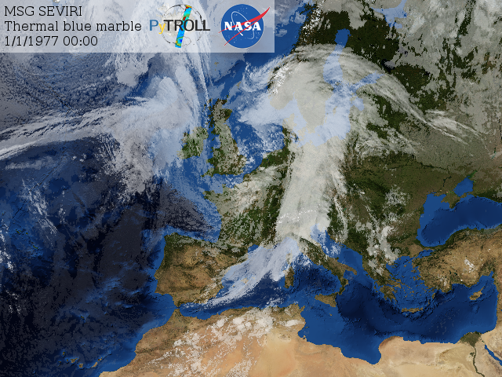
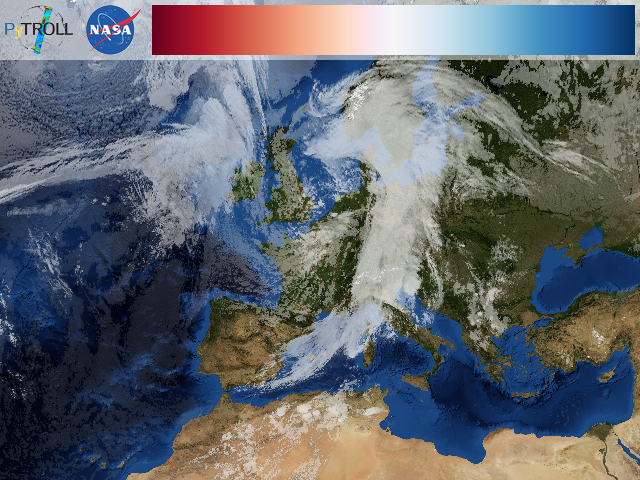
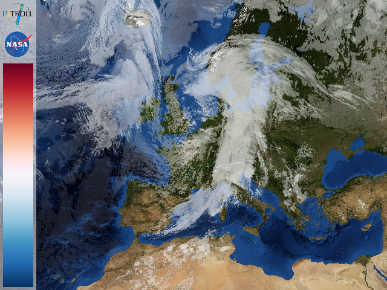
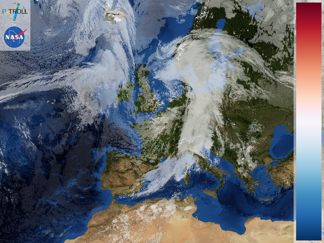
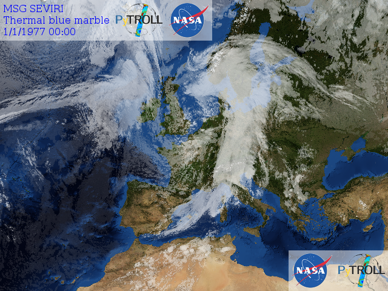
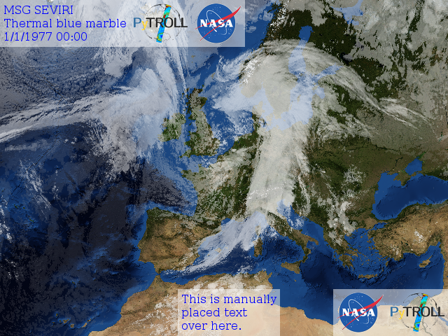
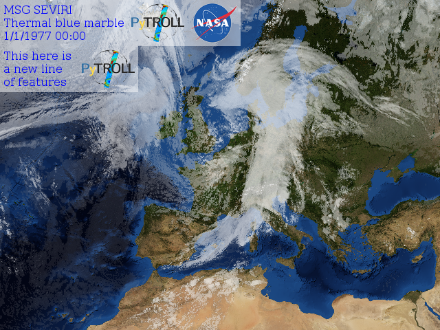
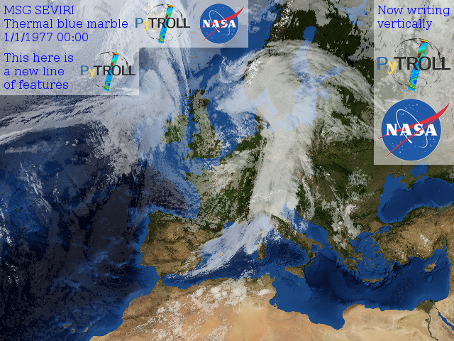
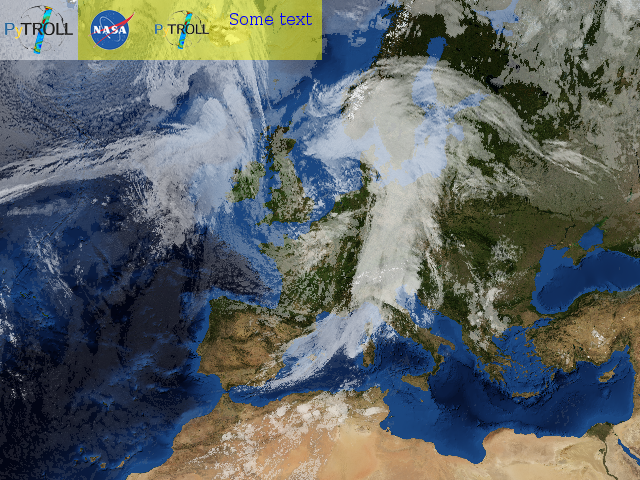

Usage
-----

Pycoast can be used to add coastlines, borders and rivers to a raster image if
the geographic projection of the image and the image extent in projection
coordinates are known

.. image:: images/BMNG_clouds_201109181715_areaT2.png

Pycoast can add contours to either a PIL image object:

    >>> from PIL import Image
    >>> from pycoast import ContourWriter
    >>> img = Image.open('BMNG_clouds_201109181715_areaT2.png')
    >>> proj4_string = '+proj=stere +lon_0=8.00 +lat_0=50.00 +lat_ts=50.00 +ellps=WGS84'
    >>> area_extent = (-3363403.31,-2291879.85,2630596.69,2203620.1)
    >>> area_def = (proj4_string, area_extent)
    >>> cw = ContourWriter('/home/esn/data/gshhs')
    >>> cw.add_coastlines(img, area_def, resolution='l', level=4)
    >>> cw.add_rivers(img, area_def, level=5, outline='blue')
    >>> cw.add_borders(img, area_def, outline=(255, 0, 0))
    >>> img.show()
    
or to an image file:

    >>> from pycoast import ContourWriter
    >>> proj4_string = '+proj=stere +lon_0=8.00 +lat_0=50.00 +lat_ts=50.00 +ellps=WGS84'
    >>> area_extent = (-3363403.31,-2291879.85,2630596.69,2203620.1)
    >>> area_def = (proj4_string, area_extent)
    >>> cw = ContourWriter('/home/esn/data/gshhs')
    >>> cw.add_coastlines_to_file('BMNG_clouds_201109181715_areaT2.png', area_def, resolution='l', level=4)
    >>> cw.add_rivers_to_file('BMNG_clouds_201109181715_areaT2.png', area_def, level=5, outline='blue')
    >>> cw.add_borders_to_file('BMNG_clouds_201109181715_areaT2.png', area_def, outline=(255, 0, 0))
    
Where the :attr:`area_extent` is the extent of the image in projection
coordinates as (x_ll, y_ll, x_ur, x_ur) measured at pixel edges.

The argument to :attr:`ContourWriter` must be replaced with your *GSHHS_DATA_ROOT*.

.. image:: images/euro_coast.png

The resulting (not so pretty) image shows the effect of the various
arguments. The :attr:`resolution` keyword argument controls the resolution of
the dataset used. It defaults to 'c' for coarse. Increasing the resolution also
increases the processing time. The :attr:`level` keyword argument controls the
detail level of the dataset used. It defaults to *1* for the lowest detail
level.

Instead of a tuple for :attr:`area_def` a pyresample_ :attr:`AreaDefinition`
object can be used.

See method docstrings for information about possible argument values see method
docstrings.

Creating an image with coastlines only:

    >>> from PIL import Image
    >>> from pycoast import ContourWriter
    >>> img = Image.new('RGB', (425, 425))
    >>> proj4_string = '+proj=geos +lon_0=0.0 +a=6378169.00 +b=6356583.80 +h=35785831.0'
    >>> area_extent = (-5570248.4773392612, -5567248.074173444, 5567248.074173444, 5570248.4773392612)
    >>> area_def = (proj4_string, area_extent)
    >>> cw = ContourWriter('/home/esn/data/gshhs')
    >>> cw.add_coastlines(img, area_def, resolution='l')
    >>> img.show()    

.. image:: images/geos_coast.png

.. _pyshp: http://code.google.com/p/pyshp/
.. _PIL: http://www.pythonware.com/products/pil/
.. _pyresample: http://code.google.com/p/pyresample/
.. _aggdraw: http://effbot.org/zone/aggdraw-index.htm

Decoration Usage (Experimental)
-------------------------------

When using the decoration functionality the following modules might need to
be imported:

  >>> from PIL import Image
  >>> from pycoast import DecoratorAGG
  >>> import aggdraw

Test data for the below examples is available on the project's
`github page <https://github.com/pytroll/pycoast>`_.
From the extracted source directory, you can read
in a demonstration image to play with:

  >>> img = Image.open('BMNG_clouds_201109181715_areaT2.png')

To begin work on decorating this PIL image object you simply
instantiate a decorator object with the PIL image as argument:

  >>> dc = DecoratorAGG(img)

.. warning::

    The below functionality was originally provided by the pydecorate
    package. This package has been absorbed in to pycoast for simplification.
    All functionality documented below should be considered experimental.

features
^^^^^^^^

Pycoast supports adding features such as picures and logos,
text, color scales and legends to your PIL image.

logos
+++++

A simple use case is to add a couple of logos.
From the extracted source directory you can add a couple of
demonstration logos:

  >>> dc.add_logo("logos/pytroll_light_big.png",height=80.0)
  >>> dc.add_logo("logos/NASA_Logo.gif")
  >>>
  >>> img.show()

text
++++

To add text, you could do:

  >>> dc.add_text("MSG SEVIRI\nThermal blue marble\n1/1/1977 00:00")
  >>> dc.add_logo("logos/pytroll_light_big.png")
  >>> dc.add_logo("logos/NASA_Logo.gif")
  >>>
  >>> img.show()

Notice how the height style of the logos follow the height of the
text that was entered.  This is because the current height style of
the decorator is automatically set to match the space required by the text.

If the add_text operation fails it is may be necessary to specify the full
path to your truetype font by loading an aggdraw font object:

  >>> font=aggdraw.Font("blue","/usr/share/fonts/truetype/ttf-dejavu/DejaVuSerif.ttf",size=16)

In doing so, you also can also control the font size and font colour.
To use this font you must pass it as an optional argument as so,

  >>> dc.add_text("MSG SEVIRI\nThermal blue marble\n1/1/1977 00:00",font=font)

scales and legends (DRAFT)
++++++++++++++++++++++++++

Pycoast can work with trollimage colormap objects to add colorbars.
To add some logos along with a standard scale feature based on the 'rdbu'
scale from trollmap one might do as follows,

  >>> from trollimage.colormap import rdbu
  >>> rdbu.set_range(-80,30)
  >>>
  >>> dc.add_logo("logos/pytroll_light_big.png")
  >>> dc.add_logo("logos/NASA_Logo.gif")
  >>> dc.add_scale(rdbu,extend=True)

Note that the extend=True option sets the scale feature to extend to the full
available space. Without this option the scale will inherit the previous width,
or one might pass a specific width as argument. See more on this topic in the
Styles section below.

Off course the placement of the logos and scale feature is very flexible.
For example if one wanted to arrange the logos vertically followed by a
vertical color scale one simply precedes the code with a write_vertically()
directive,

  >>> dc.write_vertically()
  >>>
  >>> dc.add_logo("logos/pytroll_light_big.png")
  >>> dc.add_logo("logos/NASA_Logo.gif")
  >>> dc.add_scale(rdbu,extend=True)

To separate the color scale to the right hand side, simply
throw in an alignment directive between the logos and the scale,

  >>> dc.write_vertically()
  >>>
  >>> dc.add_logo("logos/pytroll_light_big.png")
  >>> dc.add_logo("logos/NASA_Logo.gif")
  >>>
  >>> dc.align_right()
  >>>
  >>> dc.add_scale(rdbu,extend=True)

More on feature placement options in the following section.

placement
^^^^^^^^^

The decorator allows the cursor to be relocated and alligned to different sides of the image.
By default the cursor writes horizontally from the top-left corner. The cursor can however be
easily relocated at any other side of the image, and the vertical and horizontal write orientation
can be changed.

alignment
+++++++++

Continuing from the previous example,
we can align the cursor to the bottom-right corner, by executing

  >>> dc.align_right()
  >>> dc.align_bottom()

New features will now be written horizontally from the bottom-right corner
progressing leftwards. E.g.

  >>> dc.add_logo("logos/pytroll_light_big.png")
  >>> dc.add_logo("logos/NASA_Logo.gif")

Note: Currently the decorator does not provide an easy option for centered placement
of features. However the cursor position may be set manually as part of the style
arguments to achieve this kind of placement, e.g.

  >>> dc.add_text("This is a manually\nplaced text\nover here.", cursor=[400,480])

new line
++++++++

As with typewriters, the decorator can also progress to a new line of features.
Starting from our first example,

  >>> dc.new_line()
  >>> dc.add_text("This here is\na new line\nof features")
  >>> dc.add_logo("logos/pytroll_light_big.png")

horizontal/vertical writing
+++++++++++++++++++++++++++

The orientation of the cursor writes can be changed from vertical to horizontal writing.
The following statements will write some features vertically,

  >>> dc.align_right()
  >>> dc.write_vertically()
  >>>
  >>> dc.add_text("Now writing\nvertically", height=0)
  >>> dc.add_logo("logos/pytroll_light_big.png")
  >>> dc.add_logo("logos/NASA_Logo.gif")

Note that resetting the height of text to zero prevents the text feature from inheriting the height
of the previously added feature and allows it to expand to the necessary height.

styles
^^^^^^

The decorator style settings is a dictionary of
options that is retentive between successive operations
(state machine), all except for the :attr:`cursor` attribute
which is propagative as mentioned before,

    >>> default_style_dict = {
    'cursor':[0,0],
    'margins':[5,5],
    'height':60,
    'width':60,
    'propagation':[1,0],
    'newline_propagation':[0,1],
    'alignment':[0.0,0.0],
    'bg':'white',
    'bg_opacity':127,
    'line':"black",
    'line_width':1,
    'line_opacity':255,
    'outline':None,
    'outline_width':1,
    'outline_opacity':255,
    'fill':'black',
    'fill_opacity':255,
    'font':None,
    'start_border':[0,0],
    'extend':False,
    'tick_marks':1.0,
    'minor_tick_marks':0.1
    }

For example, when if at some point we define a new
background color and margins, this style does not have
to be repeated on successive calls,

    >>> dc.add_logo("logos/pytroll_light_big.png")
    >>> dc.add_logo("logos/NASA_Logo.gif",margins=[10,10],bg='yellow')
    >>> dc.add_logo("logos/pytroll_light_big.png")
    >>> dc.add_text("Some text",font=font)

